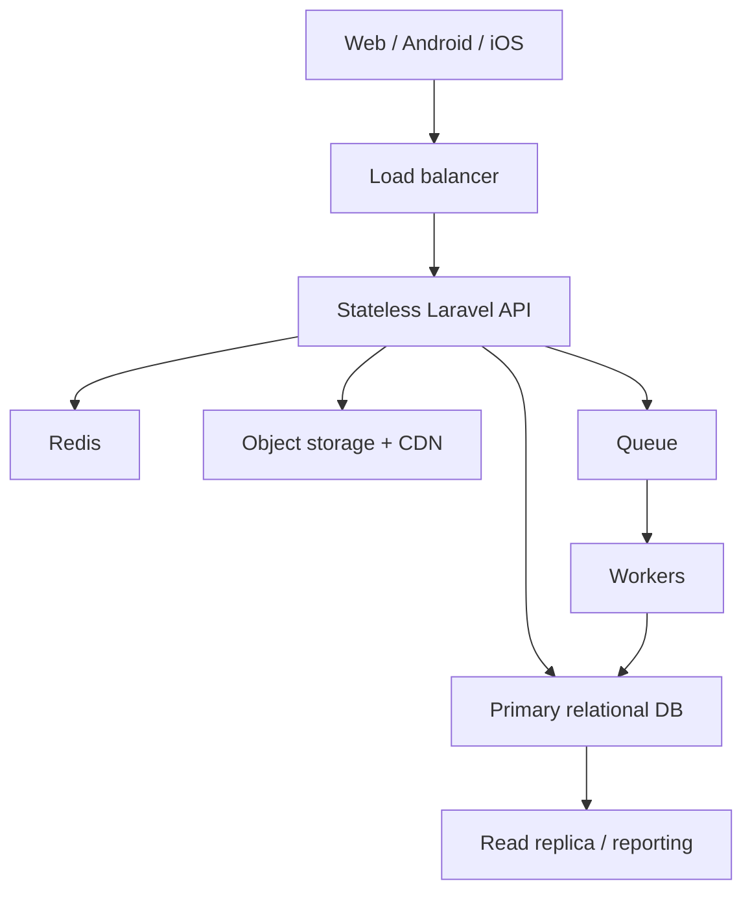

# SOA HTC — Ciljna arhitektura i model podataka

Status: radni nacrt 0.1  
Datum: 2026-08-11

## 1. Arhitektonski cilj

Predlog je modularni monolit sa jasnim domenima, jednim stabilnim API-jem i horizontalno skalabilnim stateless aplikacionim instancama. Ovaj oblik zadržava transakcioni integritet pokušaja i rezultata bez rane kompleksnosti mikroservisa, a ostavlja mogućnost kasnijeg izdvajanja read-heavy analitike, media delivery-ja ili notification poslova.

Predloženi početni stack:

- Laravel 13 i PHP 8.3+;
- Vue 3 + TypeScript + Vite;
- relacijska baza: MySQL 8.x ili PostgreSQL, konačna ADR odluka pre implementacije;
- Redis za cache, rate limiting, kratkotrajne session podatke i queue koordinaciju;
- queue workers za email, export, sertifikate, agregate i druge nekritične poslove;
- object storage + CDN za slike, audio i javne CMS medije;
- load balancer ispred više stateless API instanci;
- centralizovani logovi, metrike, tracing i error tracking.

## 2. Logički domeni

| Domen | Odgovornost | Kritičnost tokom testa |
| --- | --- | --- |
| Identity & Access | admin login, role/permission, student web session, mobile account | visoka |
| Organization | seasons, countries, regions, schools, coordinator assignments | srednja |
| Registration | sezonske prijave, competitor number, level | visoka |
| Assessment Authoring | quiz, exam, test, questions, options, level mapping | read-heavy tokom testa |
| Attempt Engine | start, timer, finish, answers, idempotency | najviša |
| Grading & Publication | automatsko/ručno ocenjivanje, statusi, objava | visoka pri završetku |
| Reporting | operativni izveštaji i istorijski agregati | izolovati od attempt toka |
| Migration | source registry, ID mapa, batch i reconciliation | van online toka |
| CMS & Navigation | public sadržaj i meniji | odvojeni cache/read model |
| Theme | jedna aktuelna tema za sve klijente | cacheable |
| Accounting | legacy-compatible poslovni modul | van prve Competition Core isporuke |

## 3. Runtime topologija



Pravila:

- session stanje ne sme zavisiti od lokalnog diska ili memorije jedne API instance;
- `started_at` i `expires_at` dolaze iz server/database vremena;
- attempt start/finish transakcije idu na primarnu bazu;
- read replica se ne koristi za odluku da li attempt može da počne ili da se završi;
- CMS i višegodišnja analitika ne dele skupe upite sa aktivnim attempt tokom.

## 4. Predloženi moduli u kodu

```text
app/Domain/
  Identity/
  Organization/
  Registration/
  Assessment/
  Attempts/
  Grading/
  Reporting/
  Migration/
  Cms/
  Theme/
  Accounting/
```

Svaki domen ima svoje actions/services, policies, DTO/value objekte, events i testove. Kontroleri ostaju tanki; Eloquent modeli ne nose višekoračnu poslovnu logiku.

## 5. Jezgro modela podataka

### 5.1 Organizacija i pristup

| Tabela | Ključna polja | Napomena |
| --- | --- | --- |
| `seasons` | `id`, `name`, `year`, `round_number`, `status`, datumi | `round_number` je deo legacy competitor broja |
| `countries` | `id`, `code`, `name` | legacy `el_country` mapa |
| `regions` | `id`, `country_id`, `name` | čuvati source mapu |
| `schools` | `id`, `country_id`, `region_id`, `name`, status | stabilni master entitet |
| `users` | `id`, email, password hash, status | admin i koordinatori |
| `roles` / `permissions` | imenovane vrednosti | legacy 10/5/1 samo migraciona mapa |
| `season_user_assignments` | `season_id`, `user_id`, role, status | sezonska aktivnost |
| `assignment_schools` | assignment, school | school scope |
| `assignment_countries` | assignment, country | country scope |
| `audit_logs` | actor, action, subject, before/after, reason, IP, time | append-only poslovni audit |

### 5.2 Registracije i mobilni nalozi

| Tabela | Ključna polja | Ograničenja |
| --- | --- | --- |
| `student_registrations` | `id`, `season_id`, `competitor_number`, ime/podaci, `school_id`, `country_id`, `difficulty_level_id`, status | unique `competitor_number`; snapshot polja za istoriju |
| `student_accounts` | `id`, email, password hash, verified_at, status | mobilna autentikacija |
| `student_account_links` | account, registration, linked_at, method, verified_by | eksplicitno povezivanje |
| `legal_documents` | type, version, locale, content/hash, effective_at | Terms/Privacy verzije |
| `legal_acceptances` | account, document, accepted_at, IP/device metadata | istorija se ne prepisuje |
| `student_access_sessions` | opaque token hash, registration, channel, expires_at, revoked_at | web pristup bez klasičnog login-a |

`competitor_number` identifikuje jednu sezonsku prijavu. Ne povezuje istu osobu između godina.

### 5.3 Difficulty i sadržaj

| Tabela | Svrha |
| --- | --- |
| `difficulty_categories` | kategorija/skup nivoa |
| `difficulty_levels` | konkretan level učenika/sadržaja |
| `quizzes` | sezonski ciklus; competition/sample konfiguracija i password hash |
| `quiz_exams` | uređena veza quiz → exam |
| `exams` | preliminary/semifinal/final ili druga faza |
| `exam_tests` | uređena veza exam → test |
| `tests` | trajanje, tip, status, max bodovi i policy dostupnosti |
| `exam_allowed_levels` | dozvoljeni level-i na exam nivou, ako se potvrdi |
| `test_allowed_levels` | dozvoljeni level-i na test nivou, ako se potvrdi |
| `questions` | tip, tekst, poeni, pozicija, media reference |
| `question_options` | ponuđeni odgovori i tačnost za multiple choice |
| `accepted_answers` | dozvoljene varijante za fill-the-gap |

Pre aktivacije sadržaja treba sačuvati nepromenljivi `assessment_version` ili snapshot koji attempt referencira. Time kasnija izmena pitanja ne menja već započet pokušaj ili istorijski rezultat.

### 5.4 Attempt, odgovori i rezultati

| Tabela | Ključna polja | Kritično ograničenje |
| --- | --- | --- |
| `attempts` | registration, test/version, mode, status, started/expires/submitted, channel, idempotency key | jedan važeći attempt po registration + test + competition scope |
| `attempt_answers` | attempt, question snapshot/reference, raw answer, normalized answer | unique attempt + question |
| `attempt_answer_options` | attempt_answer, option | za multi-select |
| `results` | attempt, auto/manual/total points, status, published_at | one-to-one sa attempt-om |
| `manual_gradings` | answer, grader, points, note, graded_at | audit ručnog bodovanja |
| `attempt_voids` | attempt, actor, reason, voided_at | reset bez brisanja |
| `publication_batches` | scope, actor, published_at | ako se potvrdi grupna objava |

Predloženi attempt statusi:

```text
created/active → submitted → pending_grading → graded → published
                    ↘ expired
active/submitted/graded/published → void
```

Precizna state machine mora biti ADR i imati database-level zaštite od nelegalnih prelaza.

## 6. Ključni indeksi i integritet

- unique `student_registrations.competitor_number`;
- index `(season_id, school_id, difficulty_level_id)`;
- unique aktivni attempt po poslovnom ključu, sproveden odgovarajućim DB mehanizmom;
- unique `(attempt_id, question_id/version_key)` za odgovore;
- unique `results.attempt_id`;
- index `(status, expires_at)` za recovery/expiry obradu;
- index publication/reporting dimenzija;
- svi foreign keys eksplicitni, osim kontrolisanih staging tabela;
- novčane i bodovne vrednosti kao `decimal`, ne floating point;
- svi datumi u UTC; locale/timezone samo na granici prikaza.

## 7. Konzistentnost i transakcije

Start testa:

1. autorizuj registraciju, quiz režim, level i dostupnost;
2. zaključaj poslovni ključ ili koristi unique constraint;
3. kreiraj attempt sa server-side vremenom;
4. vrati postojeći attempt ako je isti idempotency zahtev ponovljen;
5. commit pre slanja odgovora klijentu.

Finish testa:

1. pronađi attempt na primary bazi i zaključaj red;
2. proveri status, rok i idempotency key;
3. validiraj kompletan payload prema snapshot-u testa;
4. u jednoj transakciji upiši odgovore, status i početni rezultat;
5. ručno ocenjivanje/objava se nastavljaju odvojeno;
6. ponovljen isti zahtev vraća isti rezultat bez dupliranja.

## 8. Cache i queue granice

Bezbedno za cache:

- aktivna tema;
- public CMS sadržaj i navigacija;
- objavljena struktura testova bez tačnih odgovora;
- country/region reference;
- read-only dashboard agregati sa jasnim TTL-om.

Ne donositi iz stale cache-a:

- da li je attempt već pokrenut;
- da li je attempt istekao;
- da li je dozvoljen drugi pokušaj;
- konačni upis odgovora i objavljivanje rezultata.

Queue poslovi ne smeju biti potrebni da bi server potvrdio da je završni submit prihvaćen. Email, export, sertifikat i teški agregati jesu asinhroni.

## 9. Reporting model

Normalizovana baza je izvor istine. Za višegodišnju analitiku koristiti reporting snapshot/agregatne tabele sa dimenzijama:

- season/round;
- country/region/school;
- tadašnji country/school coordinator;
- difficulty category/level;
- quiz/exam/test/type/difficulty;
- result status i bodovne mere.

Agregati se osvežavaju asinhrono i ne smeju zaključavati attempt/result tabele tokom takmičarskog pika.

## 10. Odložene odluke

- MySQL ili PostgreSQL;
- tačan mehanizam unique aktivnog attempt-a u izabranoj bazi;
- exam/test level mapping;
- assessment versioning strategija;
- mobile framework i token lifecycle;
- read replica i reporting baza od prvog dana ili tek po merenju;
- retention i particionisanje velikih attempt/answer tabela.

