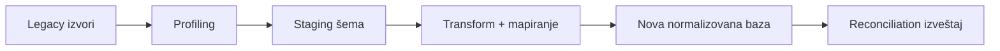

# SOA HTC — Plan migracije legacy podataka

Status: radni nacrt 0.1  
Datum: 2026-08-11

## 1. Cilj

Migrirati aktuelnu i istorijske SOA HTC baze u novu normalizovanu šemu bez gubitka poslovnih podataka, uz dokazivu mapu porekla i mogućnost ponavljanja celog procesa. Prioritet istorije je agregatna statistika po sezoni, školi, zemlji, koordinatoru, level-u i testu, ne spajanje iste osobe kroz godine.

## 2. Osnovna pravila

- Produkcioni legacy izvori su read-only tokom migracionog izvoza.
- Svaki import ima `migration_run_id`, source, sezonu, vreme, status i checksum/identifikator izvora.
- Svaki novi zapis koji dolazi iz legacy sistema ima proverljivu legacy ID mapu.
- Transformacije su kodirane, verzionisane i testirane; nisu ručni SQL koraci.
- Dry-run i reconciliation su obavezni pre stvarnog učitavanja.
- Ponavljanje istog run-a ne pravi duplikate.
- PII se ne kopira u development okruženja bez anonimizacije.
- Telescope i drugi ne-poslovni operativni podaci se ne migriraju.

## 3. Izvori

Poznati izvor:

- `soahtc_soa2024_anonimize.sql`, oko 322 MB i 49 tabela;
- `test_results` red veličine više miliona zapisa;
- dodatne baze rezultata iz prethodnih godina;
- legacy repository kao izvor formula i implicitnih veza.

Za svaki istorijski izvor napraviti registry:

| Polje | Primer |
| --- | --- |
| source key | `legacy_2025_prod_export` |
| season/year | 2025 |
| round number | 13 |
| schema/version | fingerprint tabela/kolona |
| encoding | latin1 / utf8mb3 / utf8mb4 |
| exported at | UTC datum |
| row counts | po tabeli |
| owner/approval | osoba koja potvrđuje izvor |

## 4. Migraciona arhitektura

Staging sloj čuva izvorne vrednosti dovoljno verno za audit i ponavljanje. Target loader radi u chunkovima, koristi stabilne business/source ključeve i vodi status svakog batch-a.

## 5. Predloženi redosled migracije

### Korak 1 — Profilisanje

- popis tabela, kolona, engine-a, charset-a, indeksa i procenjenih redova;
- null/empty/zero-date distribucije;
- duplikati, orphan veze i kolizije ID-jeva;
- analiza formata datuma rođenja;
- identifikacija svih mesta gde postoje rezultati i zbirne vrednosti;
- poređenje šema između godina.

Izlaz: source profile i lista data-quality pravila po sezoni.

### Korak 2 — Staging import

- učitati izvore u izolovanu staging bazu/šemu;
- sačuvati originalni ID, tabelu, source key i raw problematične vrednosti;
- normalizovati encoding u UTF-8 bez tihog gubitka karaktera;
- `0000-00-00` i slične vrednosti mapirati u `NULL` uz warning/error klasifikaciju;
- ne dodavati poslovne pretpostavke u ovom koraku.

### Korak 3 — Master podaci

Redosled:

1. seasons/rounds;
2. countries (`el_country`);
3. regions;
4. schools;
5. difficulty categories/levels;
6. admin/coordinator users i sezonske dodele.

Deduplikacija schools/countries/regions mora koristiti eksplicitna pravila i review listu, ne samo case-insensitive ime.

### Korak 4 — Student registracije

- jedan target zapis po legacy sezonskoj prijavi;
- čuvati legacy student ID, source key, season i round number;
- reprodukovati `competitor_number = round_number || LPAD(student_id, 5, '0')`;
- potvrditi globalnu jedinstvenost;
- mapirati school/country/region/level i sačuvati istorijski snapshot;
- ne pokušavati automatsko spajanje iste osobe između sezona.

### Korak 5 — Assessment sadržaj

- quizzes, exams, tests i uređene pivot veze;
- questions/options/accepted answers/media reference;
- difficulty mapiranja;
- trajanje, bodovi, statusi i redosled;
- generisati assessment version/snapshot za istorijske rezultate kada originalni sadržaj postoji.

### Korak 6 — Attempts, odgovori i rezultati

- utvrditi kanonski izvor kada ista vrednost postoji u `test_results`, `exam_results`, `quiz_results` i student tabeli;
- uvesti najdetaljniji dostupni raw odgovor;
- izvesti attempt/result status iz legacy podataka uz dokumentovano pravilo;
- čuvati source row ID za svaki rezultat;
- označiti nepovezive/orphan rezultate za review, ne odbacivati ih tiho;
- obrađivati u chunkovima sa restart checkpoint-ima.

### Korak 7 — Reporting snapshot i agregati

- snapshot sezonske škole, zemlje, regiona, koordinatora, level-a i assessment dimenzija;
- izračunati početne agregate;
- porediti broj učesnika i rezultate sa legacy izveštajima po sezoni;
- označiti razlike iznad dogovorenog praga.

### Korak 8 — Accounting i CMS

Ovo ide posle stabilizacije Competition Core-a:

- accounting se prenosi funkcionalno identično i proverava characterization testovima;
- CMS sadržaj, layout-i, kategorije, posts i navigacije dobijaju poseban mapping;
- tema se migrira samo kao aktuelna konfiguracija; stare theme verzije nisu potrebne.

## 6. ID mapping model

Predložena generička tabela `legacy_id_maps`:

| Polje | Svrha |
| --- | --- |
| `source_id` | izvorna baza/sezona |
| `source_table` | legacy tabela |
| `source_pk` | originalni primarni/poslovni ključ |
| `target_type` | target entitet |
| `target_id` | novi ID |
| `migration_run_id` | run koji je kreirao mapu |
| `source_fingerprint` | detekcija promene izvornog reda |

Unique constraint na `(source_id, source_table, source_pk, target_type)` sprečava duplikate i omogućava idempotentno ponavljanje.

## 7. Data-quality pravila

### Encoding

- eksplicitno dekodiranje source charset-a;
- invalid byte sequence je error sa source lokacijom;
- nema tihog replace karaktera bez izveštaja.

### Datumi

- validan poznat format → canonical date/datetime;
- zero-date/prazno → `NULL` uz kategoriju razloga;
- neprepoznatljivo → quarantine/review;
- originalna raw vrednost ostaje dostupna u staging-u.

### Reference i orphan zapisi

- missing master relation → quarantine ili eksplicitni `unknown` samo uz odobreno pravilo;
- privremene/import tabele se ne tretiraju automatski kao source of truth;
- svi orphan rezultati ulaze u reconciliation izveštaj.

### Bodovi

- koristiti decimal preciznost koja može reprodukovati legacy rezultat;
- uporediti raw odgovore, automatske poene, ručne poene i total;
- razlike se ne zaokružuju tiho.

## 8. Reconciliation

Svaki run proizvodi mašinski i ljudski čitljiv izveštaj:

| Provera | Cilj |
| --- | --- |
| ulazni/izlazni broj redova | objašnjen svaki migrated/skipped/failed zapis |
| competitor uniqueness | 0 duplikata |
| referential integrity | 0 neobjašnjenih orphan target veza |
| zbir učesnika | po season/country/school/level |
| zbir rezultata | po quiz/exam/test/status |
| bodovni checksum/agregati | legacy i target jednaki u dogovorenoj preciznosti |
| uzorak zapisa | end-to-end trag od izvora do UI/API izlaza |
| accounting compatibility | isti izlaz za reprezentativne slučajeve |

Razlike se klasifikuju kao expected transformation, source defect, mapping defect ili unresolved.

## 9. Test strategija migracije

- unit test svake transformacije;
- fixture-i za svaku poznatu godišnju šemu;
- property test competitor broja i jedinstvenosti;
- idempotency test ponovljenog run-a;
- restart test posle prekida batch-a;
- performance test na punoj anonimizovanoj veličini;
- golden/characterization test legacy formula i izveštaja;
- security test da migracioni log ne izlaže PII.

## 10. Cutover

Predloženi postupak:

1. nekoliko punih dry-run migracija pre produkcije;
2. potvrda finalnog reconciliation-a na poslednjem rehearsal-u;
3. freeze prozor za promene relevantnih legacy podataka;
4. finalni export i inkrementalni/finalni import;
5. smoke test kritičnih tokova i statistika;
6. formalno odobrenje prelaska;
7. DNS/traffic switch;
8. legacy aplikacija read-only kao vremenski ograničena arhiva;
9. rollback samo prema unapred probanom kriterijumu i postupku.

## 11. Otvorena pitanja

- kompletna lista istorijskih baza i njihove šeme;
- kanonski izvor zbirnih rezultata kada se legacy tabele ne slažu;
- pravila deduplikacije schools/regions/countries;
- tačna retention politika staging/raw podataka;
- maksimalni prihvatljiv cutover prozor;
- da li je potreban paralelni rad oba sistema jednu sezonu;
- ko poslovno potpisuje reconciliation po sezoni.

